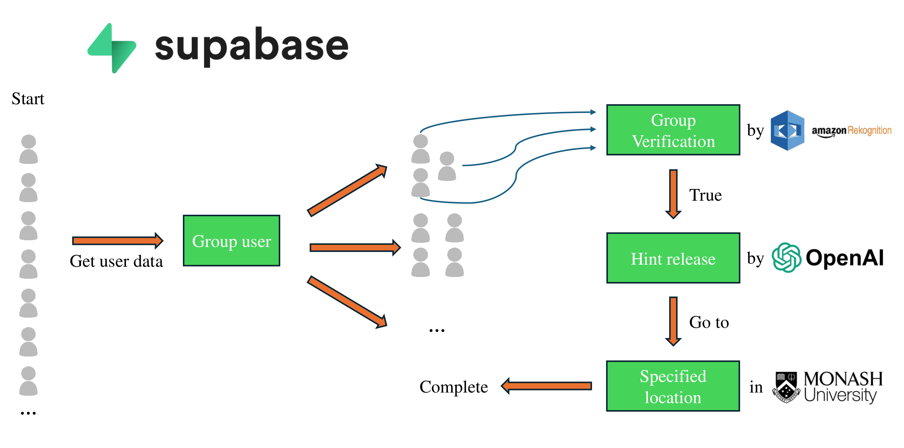

# Next.js Application with Shadcn UI

A modern, responsive web application built with Next.js, TypeScript, Tailwind CSS, and Shadcn UI components.

## Features

- **Next.js App Router**: Utilizing the latest Next.js app directory structure and routing
- **TypeScript**: Type-safe code for better developer experience
- **Tailwind CSS**: Utility-first CSS framework for rapid UI development
- **Shadcn UI**: Beautifully designed, accessible UI components
- **Dark Mode Support**: Toggle between light and dark themes
- **Responsive Design**: Mobile-first approach to ensure compatibility across devices

## Getting Started

### Prerequisites

- Node.js 18.x or later
- npm or yarn

### Installation

1. Clone the repository:

```bash
git clone https://github.com/yourusername/nextjs-shadcn-app.git
cd nextjs-shadcn-app
```

2. Install dependencies:

```bash
npm install
# or
yarn install
```

3. Run the development server:

```bash
npm run dev
# or
yarn dev
```

Open [http://localhost:3000](http://localhost:3000) with your browser to see the result.

## Project Structure

```
.
├── public/               # Static assets
├── src/
│   ├── app/              # App Router directory
│   │   ├── login/        # Login page
│   │   ├── globals.css   # Global styles
│   │   ├── layout.tsx    # Root layout
│   │   └── page.tsx      # Home page
│   ├── components/       # React components
│   │   ├── ui/           # Shadcn UI components
│   │   ├── header.tsx    # Header component
│   │   ├── footer.tsx    # Footer component
│   │   └── theme-switcher.tsx # Theme toggle component
│   └── lib/              # Utility functions
├── tailwind.config.js    # Tailwind configuration
└── next.config.js        # Next.js configuration
```

## Customization

### Theme

The application uses Shadcn UI's theming system. You can customize colors and other design tokens in the following files:

- `src/app/globals.css`: Contains CSS variables for the theme
- `tailwind.config.js`: Tailwind configuration including theme extensions

### Components

The Shadcn UI components are located in `src/components/ui/`. You can customize them according to your needs.

## Deployment

This application can be easily deployed to Vercel:

[](https://vercel.com/new/git/external?repository-url=https://github.com/yourusername/nextjs-shadcn-app)

For other deployment options, refer to the [Next.js deployment documentation](https://nextjs.org/docs/deployment).

## License

This project is licensed under the MIT License - see the LICENSE file for details.

## Acknowledgments

- [Next.js](https://nextjs.org/)
- [Shadcn UI](https://ui.shadcn.com/)
- [Tailwind CSS](https://tailwindcss.com/)
- [TypeScript](https://www.typescriptlang.org/)
